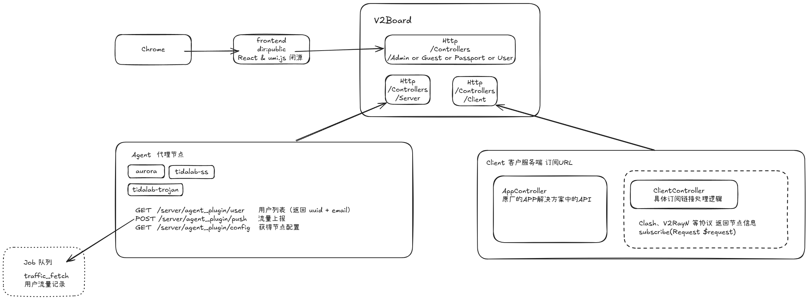

# V2boardWiki



### 分离主题
> https://github.com/vlesstop/v2board-theme-buddy

### V2board 目录解析
``` 
.
├── Console
│   ├── Commands    // 命令行工具
│   │   ├── CheckCommission.php
│   │   ├── CheckOrder.php
│   │   ├── CheckServer.php
│   │   ├── CheckTicket.php
│   │   ├── ClearUser.php
│   │   ├── ResetLog.php
│   │   ├── ResetPassword.php
│   │   ├── ResetTraffic.php  // 重置用户流量
│   │   ├── ResetUser.php
│   │   ├── SendRemindMail.php
│   │   ├── Test.php
│   │   ├── V2boardInstall.php      // v2安装时调用
│   │   ├── V2boardStatistics.php
│   │   └── V2boardUpdate.php
│   └── Kernel.php
├── Exceptions
│   └── Handler.php
├── Http
│   ├── Controllers 
│   │   ├── Admin  // 管理员后台接口
│   │   │   ├── ConfigController.php // 配置管理
│   │   │   ├── CouponController.php // 优惠券管理
│   │   │   ├── KnowledgeController.php // 知识库
│   │   │   ├── NoticeController.php // 公告
│   │   │   ├── OrderController.php // 订单
│   │   │   ├── PaymentController.php // 支付
│   │   │   ├── PlanController.php // 订阅套餐
│   │   │   ├── Server
│   │   │   │   ├── GroupController.php // 节点分组
│   │   │   │   ├── HysteriaController.php
│   │   │   │   ├── ManageController.php // 节点管理
│   │   │   │   ├── RouteController.php // 路由规则
│   │   │   │   ├── ShadowsocksController.php
│   │   │   │   ├── TrojanController.php
│   │   │   │   └── VmessController.php
│   │   │   ├── StatController.php // 统计
│   │   │   ├── SystemController.php // 系统信息
│   │   │   ├── ThemeController.php // 主题
│   │   │   ├── TicketController.php // 工单管理
│   │   │   └── UserController.php // 用户管理
│   │   ├── Client // 客户端相关接口
│   │   │   ├── AppController.php // 客户端信息
│   │   │   ├── ClientController.php // 客户端配置和信息获取
│   │   │   └── Protocols。 // 各类代理协议的配置生成
│   │   │       ├── Clash.php
│   │   │       ├── ClashMeta.php
│   │   │       ├── QuantumultX.php
│   │   │       ├── SagerNet.php
│   │   │       ├── Shadowsocks.php
│   │   │       └── V2rayNG.php
│   │   ├── Controller.php
│   │   ├── Guest // 访客访问接口
│   │   │   ├── CommController.php
│   │   │   ├── PaymentController.php 
│   │   │   ├── PlanController.php // 订阅套餐展示
│   │   │   └── TelegramController.php
│   │   ├── Passport  //  用户登录接口
│   │   │   ├── AuthController.php // 用户登录注册
│   │   │   └── CommController.php // 邮件验证码等
│   │   ├── Server // agent代理交互接口
│   │   │   ├── DeepbworkController.php  // v2ray
│   │   │   ├── ShadowsocksTidalabController.php // ss
│   │   │   ├── TrojanTidalabController.php // trojan
│   │   │   └── UniProxyController.php // 用户数据，流量统计
│   │   ├── Staff // 客服后台
│   │   │   ├── NoticeController.php // 公告管理
│   │   │   ├── PlanController.php // 订阅计划
│   │   │   ├── TicketController.php // 工单
│   │   │   └── UserController.php // 用户
│   │   └── User // 用户个人中心接口
│   │       ├── CommController.php
│   │       ├── CouponController.php // 优惠券
│   │       ├── InviteController.php // 邀请
│   │       ├── KnowledgeController.php // 知识库
│   │       ├── NoticeController.php // 公告
│   │       ├── OrderController.php // 订单
│   │       ├── PlanController.php // 订阅计划 
│   │       ├── ServerController.php // 节点
│   │       ├── StatController.php // 流量统计
│   │       ├── TelegramController.php // bot info
│   │       ├── TicketController.php // 工单
│   │       └── UserController.php // 个人信息
│   ├── Kernel.php
│   ├── Middleware // 中间件 
│   │   ├── Admin.php // admin权限校验
│   │   ├── Staff.php
│   │   ├── TrimStrings.php
│   │   ├── TrustProxies.php
│   │   ├── User.php
│   │   └── VerifyCsrfToken.php
│   ├── Requests  // validate 请求参数
│   └── Routes    // 路由
│       ├── AdminRoute.php
│       ├── ClientRoute.php
│       ├── GuestRoute.php
│       ├── PassportRoute.php
│       ├── ServerRoute.php
│       ├── StaffRoute.php
│       └── UserRoute.php
├── Jobs  // 异步任务
│   ├── OrderHandleJob.php // 订单处理
│   ├── SendEmailJob.php    // 发送邮件
│   ├── SendTelegramJob.php // 发送telegram消息
│   └── TrafficFetchJob.php  // 用户流量统计
├── Logging // 日志
│   ├── MysqlLogger.php
│   └── MysqlLoggerHandler.php
├── Models  // 表模型
├── Payments // 三方支付
│   ├── AlipayF2F.php
│   ├── BTCPay.php
│   ├── CoinPayments.php
│   ├── Coinbase.php
│   ├── EPay.php
│   ├── MGate.php
│   ├── StripeAlipay.php
│   ├── StripeCheckout.php
│   ├── StripeCredit.php
│   ├── StripeWepay.php
│   └── WechatPayNative.php
├── Plugins
│   └── Telegram // telegram bot 支持
├── Providers // 服务注册 router 等
├── Services  // 调用封装
│   ├── AuthService.php
│   ├── CouponService.php
│   ├── MailService.php
│   ├── OrderService.php
│   ├── PaymentService.php
│   ├── PlanService.php
│   ├── ServerService.php
│   ├── StatisticalService.php
│   ├── TelegramService.php
│   ├── ThemeService.php
│   ├── TicketService.php
│   └── UserService.php
└── Utils
```
### admin 后台

#### agent节点管理
> app>Http>Controllers>Admin>Server
- save 保存&更新
- drop
- update 更新可见性
- copy 复制

### 用户客户端 订阅相关
- 剩余流量
- node节点
> app>Http>Controllers>Client

### agent 交互

> app>Http>Controllers>Server

path param 动态分发 非常不安全呀
``` 
class ServerRoute
{
    public function map(Registrar $router)
    {
        $router->group([
            'prefix' => 'server'
        ], function ($router) {
            $router->any('/{class}/{action}', function($class, $action) {
                $ctrl = \App::make("\\App\\Http\\Controllers\\Server\\" . ucfirst($class) . "Controller");
                return \App::call([$ctrl, $action]);
            });
        });
    }
}
```

队列 用户流量统计
> app>Jobs>TrafficFetchJob.php

``` 
type User struct {
    ID                int       // 用户ID
    InviteUserID      *int      // 邀请人ID
    U                 int64     // 已用上行流量（字节）
    D                 int64     // 已用下行流量（字节）
    TransferEnable    int64     // 总流量配额（字节）
    SpeedLimit        *int      // 限速（Mbps）
}
```

### 数据库

- 用户相关

| 表名                  | 用途                               |
| ------------------- | -------------------------------- |
| `v2_user`           | 主用户表，记录用户的账号、密码、UUID、流量、套餐、权限等信息 |
| `v2_invite_code`    | 邀请码系统，记录用户创建的邀请码及状态、访问量          |
| `v2_ticket`         | 工单系统，记录用户的申诉/反馈                  |
| `v2_ticket_message` | 工单详情内容                           |

- 流量

| 表名               | 用途                     |
| ---------------- | ---------------------- |
| `v2_stat_user`   | 记录用户在某天或某月使用的上下行流量和倍率  |
| `v2_stat_server` | 记录每个节点每天/月的使用流量统计      |
| `v2_stat`        | 总体系统级别的统计（订单量、佣金、注册量等） |

- 支付与订单

| 表名                  | 用途                         |
| ------------------- | -------------------------- |
| `v2_order`          | 用户订单记录，包括新购/续费/升级、折扣、佣金状态等 |
| `v2_coupon`         | 优惠券管理，支持限制使用次数、适用套餐等       |
| `v2_commission_log` | 邀请返利记录，记录订单关联的返佣信息         |
| `v2_payment`        | 支付方式设置，如支付宝、微信、Stripe等接口参数 |

- 套餐 & 分组

| 表名                | 用途                   |
| ----------------- | -------------------- |
| `v2_plan`         | 套餐表，定义每个套餐的流量、限速、价格等 |
| `v2_server_group` | 节点组，用于对多个节点进行分组管理    |

- 节点信息

| 表名                      | 用途                                   |
| ----------------------- | ------------------------------------ |
| `v2_server_vmess`       | Vmess 节点信息（host、port、tls、ws/gRPC等设置） |
| `v2_server_trojan`      | Trojan 节点信息                          |
| `v2_server_shadowsocks` | Shadowsocks 节点信息                     |
| `v2_server_hysteria`    | Hysteria 节点信息                        |
| `v2_server_route`       | 节点路由策略（匹配规则和动作）                      |

- 内容与消息系统

| 表名             | 用途                       |
| -------------- | ------------------------ |
| `v2_notice`    | 公告栏（通知用户信息）              |
| `v2_knowledge` | 知识库系统，用于 FAQ、教程文档等       |
| `v2_mail_log`  | 邮件发送日志                   |
| `failed_jobs`  | Laravel 队列失败任务日志         |
| `v2_log`       | 操作日志，记录接口调用、错误、IP 等上下文信息 |

